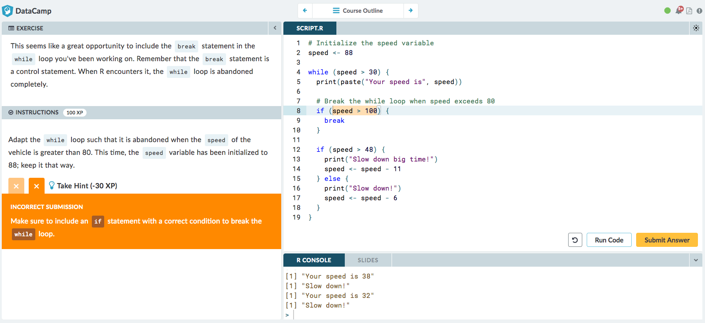

```{r setup, include=FALSE}
knitr::opts_chunk$set(echo = TRUE)
# install remotes if it isn't already installed
if (!require("remotes")) {
  install.packages("remotes")
}
```

Immediate and personalized feedback has been central to the learning experience on DataCamp since we launched the first courses. If students submit code that contains a mistake, they are told where they made a mistake, and how they can fix this. You can play around with it in our [free Introduction to R course](https://campus.datacamp.com/courses/free-introduction-to-r/chapter-1-intro-to-basics-1?ex=1). The screenshot below is from our [Intermediate R course](https://campus.datacamp.com/courses/intermediate-r).



To check submissions and generate feedback, every exercise on DataCamp features a so-called Submission Correctness Test, or SCT.

The SCT is a script of custom tests that assesses the code students submitted and the output and variables they created with their code. For every language that we teach on DataCamp, we have built a corresponding open-source package to easily verify all these elements of a student submission. For R exercises, this package is called `testwhat`. Over the years, we've added a lot of functions to:

- check variable assignment
- check function calls and results of function calls
- check if statements, for loops, and while loops
- check function definition
- check whether the proper packages are loaded
- check the output the student generated
- checking ggplot and ggvis plotting calls
- ...

When these checking functions spot a mistake, they will automatically generate a meaningful feedback message that points students to their mistakes. You can also specify custom feedback messages that override these automatically generated messages.

Historically, `testwhat` was closely linked with our proprietary backend that executes R code on DataCamp's servers. Even though `testwhat` has always been open source, it wouldn't work well without this custom backend and `testwhat` could only be used in the context of DataCamp. Today, however, `testwhat` can be used independently and supports other use cases as well. You can leverage everything `testwhat` has to offer to test student submissions, even when your format of teaching is very different from DataCamp's. You can install the package from GitHub:

```{r, message = FALSE}
library(remotes) # devtools works fine too
install_github('datacamp/testwhat')
```

As a quick demo, assume that you ask students to create a variable `x` equal to 5. A string version of the ideal solution would be something like this:

```{r}
solution_code <- 'x <- 5'
```

Now suppose that the student submitted a script where `x` is incorrectly set to be a vector of two values, which can be coded up as follows:

```{r}
student_code <- 'x <- c(4, 5)'
```

`testwhat` features a function called `setup_state()` that executes a student submission and a solution script in separate environments and captures the output and errors the student code generated. All of this information is stored in the so-called _exercise state_ that you can access with `ex()`:

```{r}
library(testwhat)
setup_state(stu_code = student_code,
            sol_code = solution_code)
ex()
```

This exercise state can be passed to the wide range of checking functions that `testwhat` features with the piping syntax from `magrittr`. To check whether the student defined a variable `x`, you can use `check_object()`:

```{r}
ex() %>% check_object('x')
```

This code runs fine, because the student actually defined a variable `x`. To continue and check whether the student defined the variable `x` _correctly_, you can use `check_equal()`:

```{r, error = TRUE}
ex() %>% check_object('x') %>% check_equal()
```

This errors out. `check_equal()` detects that the value of `x` in the student environment (a vector) does not match the value of `x` in the solution environment (a single number). Notice how the error message contains a human-readable message that describes this mistake.

The above example was interactive: you set up a state, and then go on typing chains of check functions. On a higher level, you can use `run_until_fail()` to wrap around the checking code. This will run your battery of tests until it fails:

```{r}
library(testwhat)
setup_state(stu_code = 'x <- 4',
            sol_code = 'x <- 5')
res <- run_until_fail({
  ex() %>% check_object('x') %>% check_equal()
})
res$correct
res$message
```

This basic approach of building an exercise state with a student submission and solution and then using `run_until_fail()` to execute a battery of tests can easily be embedded in an autograding workflow that fits your needs. Suppose your students have submitted their assignments in the form of an R script that you have downloaded onto your computer in the folder `submissions` (we have prepopulated the folder with some random data). We have a bunch of R scripts in the `submissions` folder. Each R script contains a student submission:

```{r, include = FALSE}
folder_name <- 'submissions'
dir.create(folder_name, showWarnings = FALSE)
set.seed(1234)
n <- 10
v <- sample(4:6, n, replace = TRUE)
student_codes <- sprintf('x <- %s', v)
file_names <- file.path(folder_name, sprintf('student_%s.R', letters[1:n]))
mapply(writeLines, student_codes, file_names)
```

```{r}
dir('submissions')
readLines('submissions/student_a.R')
readLines('submissions/student_b.R')
```

We can now cycle through all of these submissions, and generate a data.frame that specifies whether or not the submission was correct per student:

```{r}
library(testwhat)

folder_name <- 'submissions'
all_files <- file.path(folder_name, dir(folder_name))
student_results <- sapply(all_files, function(file) {
  student_code <- readLines(file)
  setup_state(sol_code = 'x <- 5',
              stu_code = student_code)
  res <- run_until_fail({
    ex() %>% check_object('x') %>% check_equal()
  })
  res$correct
})
results_df <- data.frame(name = all_files, correct = student_results,
                         row.names = NULL, stringsAsFactors = FALSE)
results_df
```

This small demo is still a bit rough, but I hope it brings the point across: with some R fiddling to build the appropriate inputs for `setup_state()`, you can put all of `testwhat`'s checking functions to work. The tests you specify in `run_until_fail()` will both verify the students' work and generate meaningful feedback to point them to the mistakes they are making.

To learn more about `testwhat`, you can visit the [GitHub repo](https://github.com/datacamp/testwhat) or the [package documentation](https://datacamp.github.io/testwhat), generated with `pkgdown`. It features both vignettes that outline how to use certain checking functions as well as reference function that describes all arguments you can specify. Don't hesitate to raise issues on GitHub or reach out through [content-engineering@datacamp.com](mailto:content-engineering@datacamp.com), we love feedback! Happy teaching!

_This blog was generated with RMarkdown. You can find the source [here](https://github.com/datacamp/testwhat/blob/master/inst/blogposts/use-testwhat-to-teach-r.Rmd)._

